Objective-C学习之路-由浅入深
====================

一、Objective-C简介
===============

> Objective-C 简称OC /Obj-c  
> Objective 是面向对象的，OC是在C语言的基础上添加了一些新的面向对象的语法，比较繁琐的语法封装的更为简单，所以在学习Objective-C之前大家必须去学习C语言一些基本的语法之类，这里我也写了C语言的学习博客，[去学习C语言](http://blog.csdn.net/qq_33750826/article/details/53282904)，大家可以参考一下。  
> 所以OC它是完全兼容C语言的，我们可以在任何的OC语言中写任意的C代码。

* * *

二、Objective-C的第一个Hello World
============================

    #import <Foundation/Foundation.h>
    
    int main(int argc, const char * argv[]) {
        @autoreleasepool {
            // insert code here...
            NSLog(@"Hello, World!");
        }
        return 0;
    }

学习的知识点：  
1.main函数仍然是程序的出入口，  
2.使用NSLog()函数进行打印输出，  
3.@”“表示一个字符串

* * *

三、\#import 的介绍
=============

在学习了C语言之后，我们知道如果想要  
引用系统中的头文件使用：#include<XXXX>  
引用自己定义的头文件使用：#include “xxxx”  
而在OC中使用的是#import,那么引入#improt有什么好处呢？

首先我们分别创建一个a.c和b.c文件并分别自动生成一个a.h和b.h的头文件：  
a.h中添加#include “b.h”

    #ifndef a_h
    #define a_h
    
    #include <stdio.h>
    #include "b.h"
    
    #endif /* a_h */
    

b.h中添加#include “a.h”

    #ifndef b_h
    #define b_h
    
    #include <stdio.h>
    #include "a.h"
    
    #endif /* b_h */
    

这种现象叫做重复包含,然后：  
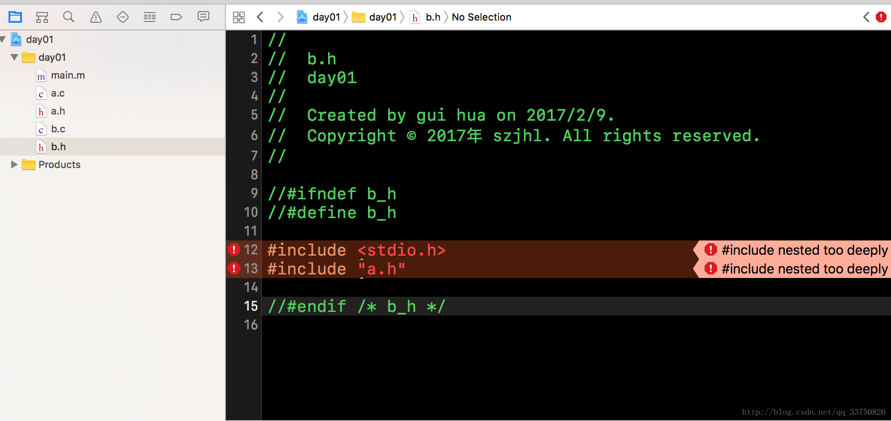  
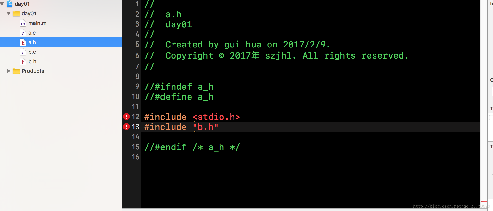  
  
发现我们的include会报错，然后我们改成import：  
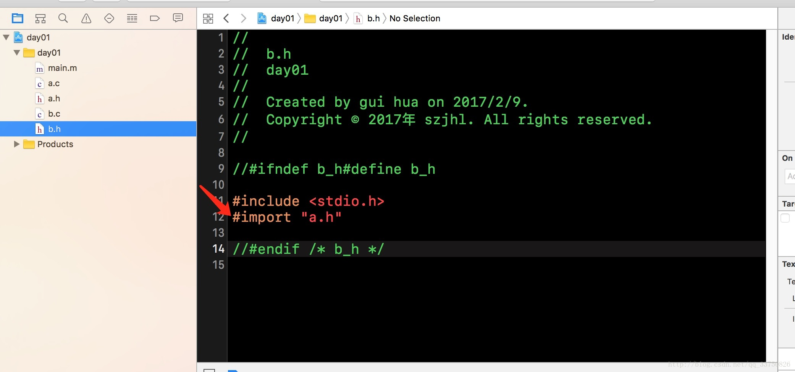  
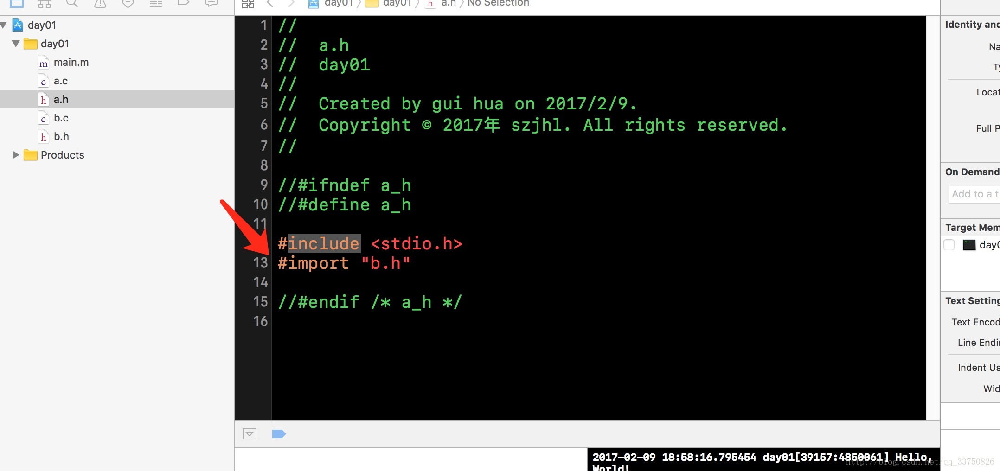  
会发现我们的报错就消失了，这到底是为了什么呢？  
首先我们在a.h与b.h中都是：

    //#ifndef b_h
    //#define b_h
    
    //#endif /* b_h */

ifndef:表示如果不存在就引入b.h文件，存在就啥都不干  
define:表示默认引入b.h文件  
endif:结束语，否则不引入b.h

而我们的import：  
\#import指令是#include指令的增强版，能实现include的功能

.

*   列表内容#include指令单独使用，可能会造成重复包含，要防止重复包含，用预编译指令配合才能防止重复包含。
*   \#import增强的点就是单独使用这个指令的时候，不会造成重复包含，同一个文件中，无论被#import多少次，在预编译的时候只会包含一次。
*   \#import指令的底层会自动判断这个文件是否包含，没有包含的时候才会包含
*   \#import指令包含的时候和#include一样，也分为
*   *   \#import “” ，例如我们例子中的#import “a.h”  
        
        文件搜索顺序：先从当前文件夹下-->编译器的文件夹下-->系统文件夹-->查找失败
        
    *   \#import <>,例如我们例子中的#import

四、NSLog()、NSString、NS前缀介绍、@符号介绍：
================================

1、NSLog():C语言中的printf中的增强版  
作用:在控制台打印数据  
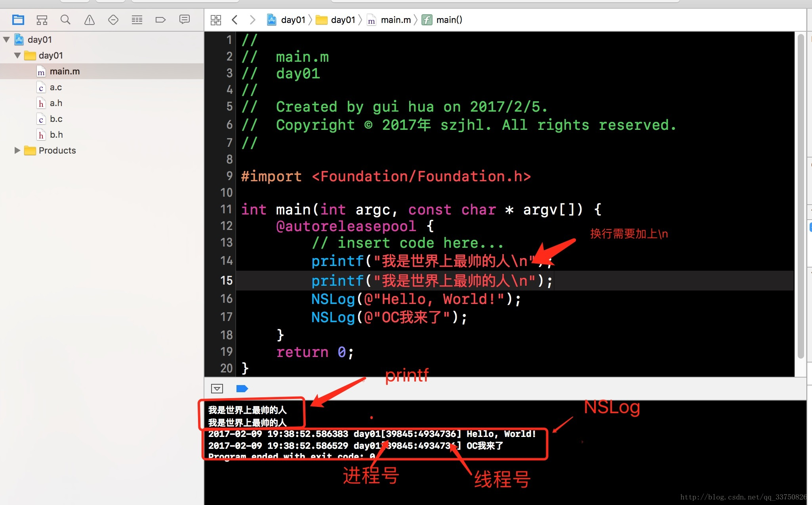  
好处：打印清晰，不用输入\\n，会自动换行

2、NSString():OC中特意设置了NSString指针去储存字符串，使用NSString指针变量可以保存1个字符串数据的地址。

> 注意：  
> 一、OC字符串OC字符串必须以@开头  
> 二、@必须写在”“前面  
> 三、在OC中打印字符串使用%@  
> 四、 NSString只能储存字符串数据地址

例如：

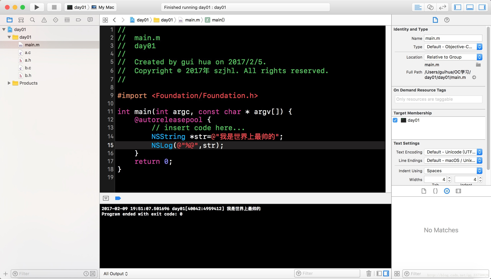

与C语言相比增加了一个@。

3、NS前缀():

> 前缀:在OC应用中所有的类名都必须是全局唯一的，由于很多不同的框架会有一些相似的功能，所有在名字上也会有重复的可能，所以苹果官方文档规定类名需要2-3个字母作为前缀。  
> 类前缀：  
> 苹果官方建议两个字母作为前缀的类名是为官方的库和框架准备的，而对于作为第三方开发者的我们，官方建议使用3个或者更多的字母作为前缀去命名我们的类。  
> NS来自于NeXTStep 的一个软件 NeXT Software.OC中不支持命名空间，NS是为了避免命名冲突而给的前缀，看到NS前缀就是知道是Cocoa中的系统类的名称

4、@符号介绍:在OC中@符号有两种含义:

1.  @”“：代表OC语言中的一个字符串，例如：@”你好世界”
2.  @直接接英文：代表OC语言中的一个关键字，例如：@interface

* * *

五、在OC中调用C代码：
============

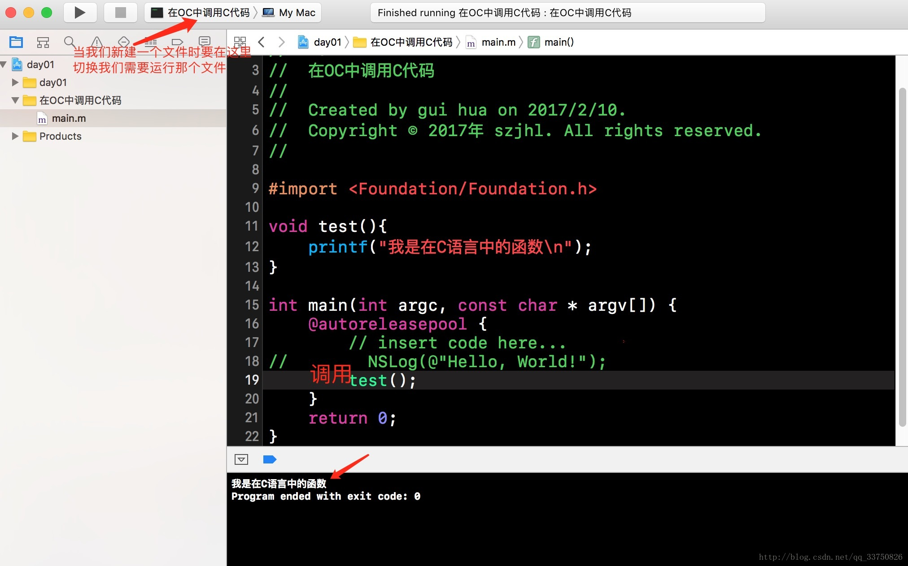  
以上我们是在OC中直接写C代码，现在我们来看下:  
创建一个Show.c:

    #include "Show.h"
    
    void showTest(){
        printf("我是C语言写的，何人敢调用我啊\n");
    }
    

Show.h:

    #ifndef Show_h
    #define Show_h
    
    #include <stdio.h>
    
    extern void showTest();
    
    #endif /* Show_h */
    

main.m:  
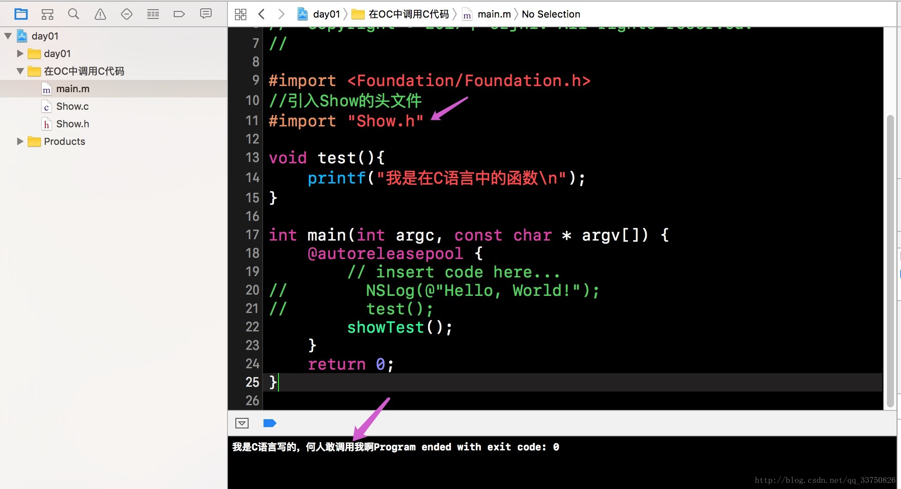  
我们在main中调用新创建的.c文件代码看到也是可以调用的。

* * *

六、OC中的布尔类型：
===========

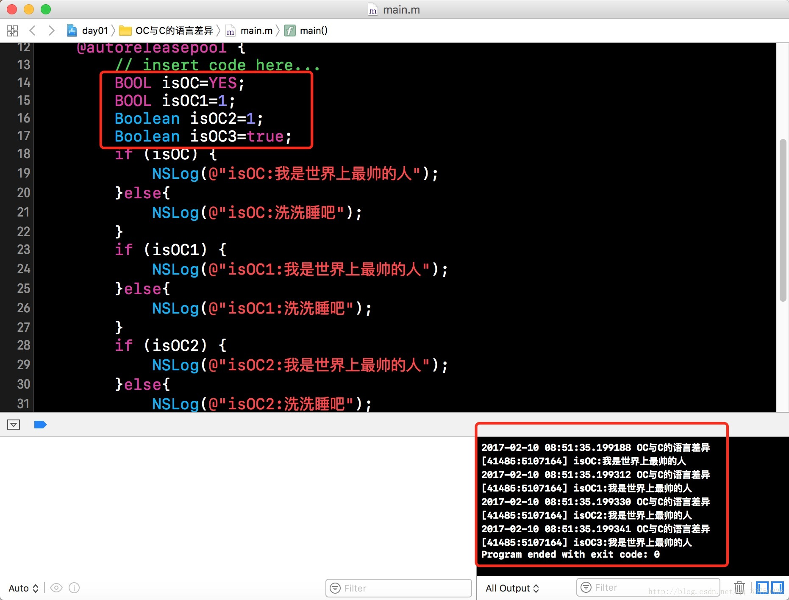  
我们知道C语言中是没有布尔类型的，使用int类型去表示真假,2而OC提供了BOOL和Boolean去表示真假。

* * *

七、类的声明和实现
=========

> 类：.h文件为类的声明文件，用于声明成员变量、方法。类的声明使用关键字@interface和@end
> 
> 注意：.h中的方法只是做一个声明，并不对方法进行实现，也就是说，只是说明一个方法名，方法的返回值类型、方法接受的参数类型而已，并不会编写方法内部的代码
> 
> .m：类的实现文件，用于实现.h中声明的方法，类的实现使用关键字@implementation和@end
> 
> 方法：方法的声明和实现，都必须以+或者-开头  
> +表示类方法(静态方法)  
> -表示对象方法(动态方法)
> 
> 成员变量：成员变量作用域有3中：  
> 1.@public 全局都可以访问  
> 2.@protected 只能在类内部和子类访问  
> 3\. @private 只能在类内部访问

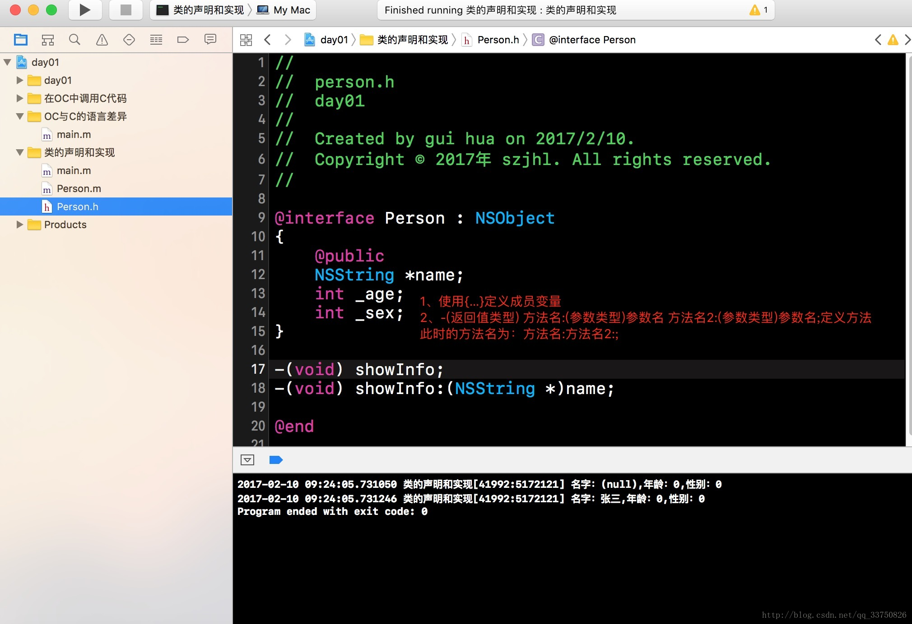

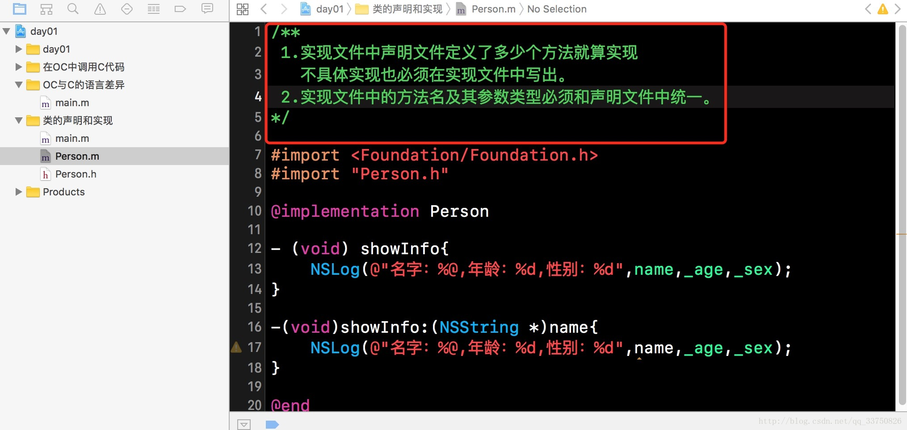  
以上我们可以看到：  
1、类的声明：@interface 类名:父类类名(NSObject是所有类的父类)  
2、类的实现：@implementaion 需要实现的类名

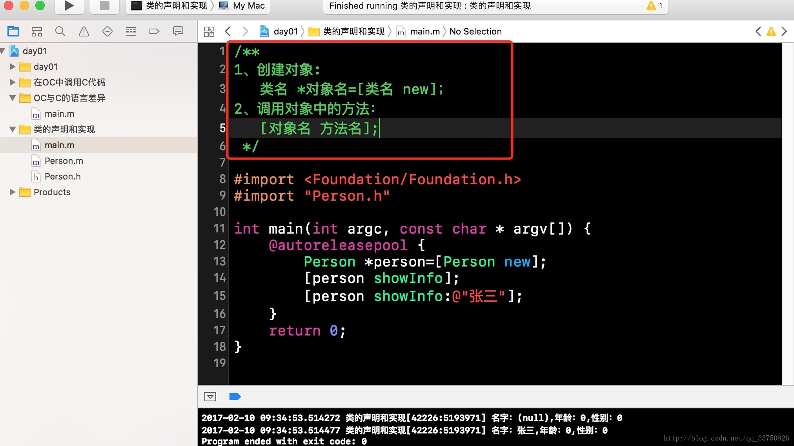

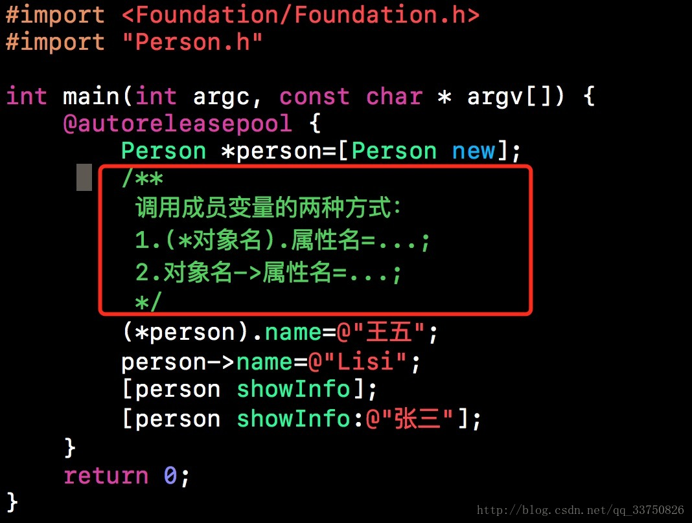

* * *

八、#pragma mark指令的使用，函数与对象方法的区别，常见注意点
====================================

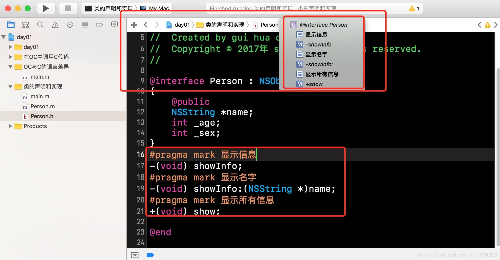  
当我们一个类中有大量代码，为了容易区分我们可以使用 #pragma mark 需要备注的信息

函数与对象方法的区别：  
1.函数使用的时候直接调用，对象方法需要创建对象才能调用  
2.函数不能放在声明中，对象方法的实现和声明只能方法在关键字练  
3.函数不可以访问对象中的成员变量  
4.对象方法归类所有

常见注意点：  
1.实现和声明必须一一对应  
2.@implementation、@interface、@end不能嵌套包含  
3.成员变量必须写在{}里面，方法必须写在{}的外面  
4.在声明时不能对类的成员变量初始化，请注意成员变量不能脱离对象而独立存在。  
5.成员变量和方法不能使用static等关键字修饰，主要是不要和C语言混淆  
6.类的实现可以写在main函数后面，在使用之前只要有声明就可以

* * *

九、NSString类简单介绍及用法
==================

1.四种创建字符串的方式:

    #import <Foundation/Foundation.h>
    
    int main(int argc, const char * argv[]) {
        @autoreleasepool {
            //1.
            NSString *name=@"张三";
            NSLog(@"%@",name);
    
            //2.
            NSString *string = [NSString new];
            string=@"李四";
            NSLog(@"%@",string);
    
            //3.
            NSString *string2= [[NSString alloc] initWithFormat:name];
            NSLog(@"%@",string2);
    
            //4.
            NSString *string3=[NSString
                               stringWithFormat:@"图片 xxx %02d- %02d",0x13,10];
            NSLog(@"%@",string3);
    
        }
        return 0;
    }
    

1.NSString字符串长度的计算方式:  

    NSString *str=@"abcdefg";
    NSLog(@"str的长度为：%ld",[str length]);//7
    

* * *

十、类方法介绍
=======

前面我们说过用+修饰的代表类方法,例如：  
Person.h:

    @interface Person : NSObject
    {
        @public
        NSString *_name;
    }
    + (void) show:(NSString *)name;
    
    - (void) showObj;
    
    @end

Person.m:

    #import <Foundation/Foundation.h>
    #import "Person.h"
    
    @implementation Person
    
    + (void) show:(NSString *)name{
        NSLog(@"name=%@",name);
    }
    
    - (void) showObj{
        NSLog(@"name=%@",_name);
    }
    
    @end
    
    

main.m:

    #import <Foundation/Foundation.h>
    #import "Person.h"
    
    int main(int argc, const char * argv[]) {
        @autoreleasepool {
            Person *person=[Person new];
            person->_name=@"我是通过对象来调用";
            [person showObj];
            [Person show:@"我是通过类调用的"];
        }
        return 0;
    }
    

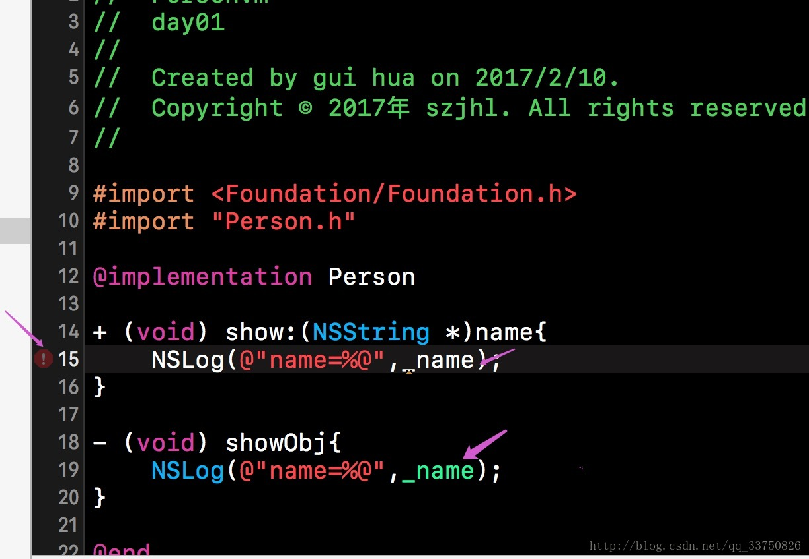

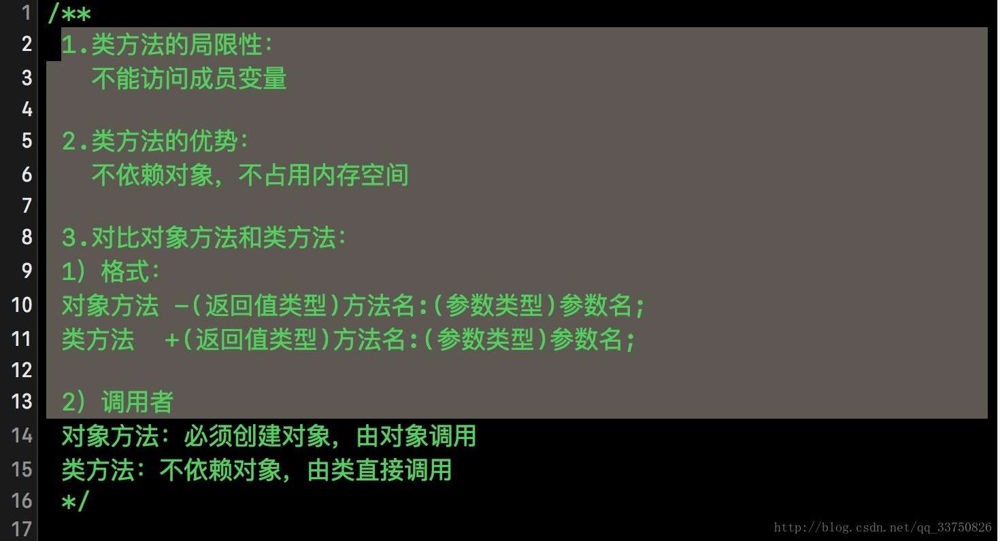

* * *

十一、self的用法
==========

Student.h

    @interface Student : NSObject
    
    - (void) study;
    
    - (void) eat;
    
    @end

Student.m

    #import <Foundation/Foundation.h>
    #import "Student.h"
    
    @implementation Student
    
    - (void) study{
        NSLog(@"我在学习啊。。");
        [self eat];
    }
    
    - (void) eat{
        NSLog(@"我在吃啊。。");
    }
    
    @end
    

main.m

    #import <Foundation/Foundation.h>
    #import "Student.h"
    
    int main(int argc, const char * argv[]) {
        @autoreleasepool {
            Student *s=[Student new];
            [s study];
        }
        return 0;
    }
    

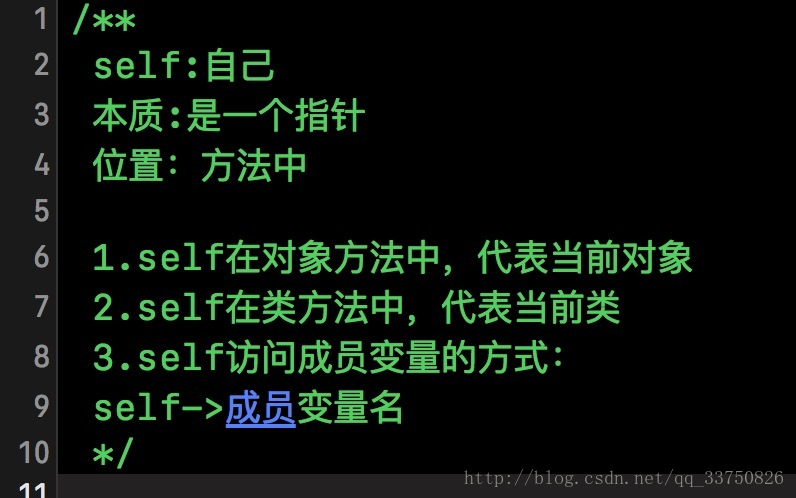

* * *

十二、description与Super的使用
=======================

Worker.h

    @interface Worker : NSObject
    {
        @public
        NSString *_name;
        int _num;
    }
    
    - (void)setName:(NSString *)name;
    - (NSString *)name;
    - (void)setNum:(int)num;
    - (int)num;
    @end

Worker.m

    #import <Foundation/Foundation.h>
    #import "Worker.h"
    
    @implementation Worker
    /**- (NSString *)description
    {
        return _name;
    }*/
    - (void)setName:(NSString *)name{
        _name=name;
    }
    - (NSString *)name{
        return _name;
    }
    - (void)setNum:(int)num{
        _num=num;
    }
    - (int)num{
        return  _num;
    }
    
    
    
    @end
    

main.m

    #import <Foundation/Foundation.h>
    #import "Worker.h"
    
    int main(int argc, const char * argv[]) {
        @autoreleasepool {
            Worker *worker=[Worker new];
            worker->_name=@"张三";
            NSLog(@"worker:%@",worker);
        }
        return 0;
    }
    

运行结果：  
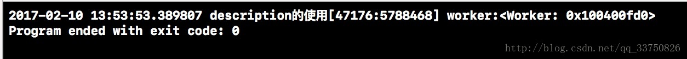

我们看到Worker.m中我们有一个description的方法，我们打开它然后运行：  
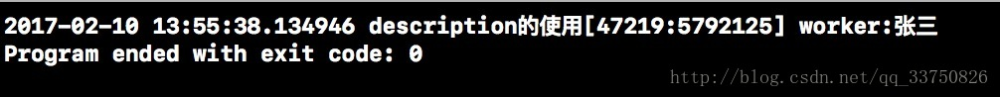  
这时候可以看到原本输出的地址值变成了我们description 方法中的值输出了  
(NSString*) description  
1.所有的类，都有description方法  
2.作用：赋值NSLog输出

二、Super应用场景：  
  
1.用在对象的方法中  
         调用对象父类的对象方法  
2.用在类方法中  
         调用类的父类的类方法

* * *

十三、成员变量修饰符的介绍
=============

成员变量修饰符：  
1.@public :(公开)只要导入头文件，任何位置都可以使用  
2.@protected:(半公开)可以在本类和子类当中进行访问(new出来的对象是调用不到的)  
3.@private：(私有)只能在本类当中进行访问，子类无法进行访问赋值  
     @private修饰的成员变量子类不能直接访问，但是子类因为继承了这个@private修饰的成员变量，所以子类也不能重新定义这个成员变量。  
4.@package:在同一框架内，可以直接访问

* * *

十四、多态的介绍
========

为什么父类可以访问子类继承自父类的方法，但是无法访问子类独有的方法？  
1.编译器编译时：  
编译器在编译时，只检查指针变量的类型，确定该指针变量类型里面有下面调用的方法，如果有该方法，编译器就认为，是正确的，可以编译通过。  
2.运行时，会动态监测对象的真实类型，然后，调用对象自己的方法

父类指针，指向子类对象的这种形式，叫做多态。  
当父类想要访问子类特有的方法时，强制类型转换。

* * *

十五、类对象
======

1.类代码存储在代码区。  
2.当程序运行时，类第一次被访问，加载到代码区，这个加载类的过程称为类加载  
3.类一旦加载到代码区之后，就一直不会释放，直到程序结束的时候才会被释放  
4.任何数据存储于代码区，都有数据类型，那么类的数据类型什么呢？如何获取呢？  
main.m

    #import <Foundation/Foundation.h>
    #import "Teacher.h"
    
    int main(int argc, const char * argv[]) {
        @autoreleasepool {
            Teacher *teacher=[Teacher new];
            //第一种获取类对象的方法
            Class c1=[teacher class];
    
            //第二种获取类对象方法
            Class c2=[Teacher class];
           // c2= [Teacher new];
            //[(Teacher*)c2 test];
            [c2 show];
           // c2->_num;
    
            NSLog(@"c1=%p,c2=%p",c1,c2);
        }
        return 0;
    }
    

总结：  
1.类对象可以调用类方法  
2.类对象可以创建出一个对象  
3.不能用类对象调用方法  
4.不能用类对象给成员变量赋值

* * *

十六、SEL的使用：
==========

    #import <Foundation/Foundation.h>
    #import "Person.h"
    
    int main(int argc, const char * argv[]) {
        @autoreleasepool {
            Person *per=[Person new];
            //test为对象中的方法，
            //如果对象per中没有test方法就会报错
            SEL s=@selector(test);
            //调用方式：[对象名 performSelector:SEL的变量名]
            [per performSelector:s];
        }
        return 0;
    }
    

* * *

十七、点语法的使用
=========

我们知道OC是面向对象的，所以必然有三大特性：封装，多态，继承,封装就是将我们的属性给封装起来使用set和get去得到属性  
Person.h

    @interface Person : NSObject
    {
        @public
        NSString *_name;
        int _age;
        int _sex;
    }
    - (void)setName:(NSString*)name;
    - (NSString*)name;
    - (void)setAge:(int)age;
    - (int)age;
    - (void)setSex:(int)sex;
    - (int)sex;
    
    @end

Person.m

    #import <Foundation/Foundation.h>
    #import "Person.h"
    
    @implementation Person
    
    - (void)setName:(NSString*)name{
        _name=name;
    }
    - (NSString*)name{
        return  _name;
    }
    - (void)setAge:(int)age{
        _age=age;
    }
    - (int)age{
        return _age;
    }
    - (void)setSex:(int)sex{
        _sex=sex;
    }
    - (int)sex{
        return _sex;
    }
    
    @end

main.m

    #import <Foundation/Foundation.h>
    #import "Person.h"
    
    int main(int argc, const char * argv[]) {
        @autoreleasepool {
            Person *p=[Person new];
            p.name=@"张三";
            p.age=10;
            p.sex=1;
            NSLog(@"name=%@,age=%d,sex=%d",p.name,p.age,p.sex);
        }
        return 0;
    }
    

点语法的本质就是set和get方法的调用

* * *

十八、@property、@synthesize关键字的使用
==============================

@property的作用：能够自动生成get和set方法的声明，  
定义方式：@property 成员变量类型 成员变量名（去掉下划线）  
在XCode4.4版本之前需要配合@synthesize使用

Person.h

    @interface Person : NSObject
    {
    @public
        NSString *_name;
        NSString *name;
        int _age;
        int _sex;
    }
    /**- (void)setName:(NSString*)name;
    - (NSString*)name;
    - (void)setAge:(int)age;
    - (int)age;
    - (void)setSex:(int)sex;
    - (int)sex;
     */
    @property NSString *name;
    @property int age,sex;
    
    @end

Person.m

    #import <Foundation/Foundation.h>
    #import "Person.h"
    
    @implementation Person
    
    @synthesize name,age,sex;
    @end
    

main.m:

    #import <Foundation/Foundation.h>
    #import "Person.h"
    
    int main(int argc, const char * argv[]) {
        @autoreleasepool {
            Person *p=[Person new];
            //这步能够调用，证明@property生成了set和get方法的声明
            p.name=@"张三";
            p.age=10;
            p.sex=1;
            //证明@synthesize生成了set和get的实现
            NSLog(@"name=%@,age=%d,sex=%d",p.name,p.age,p.sex);
        }
        return 0;
    }

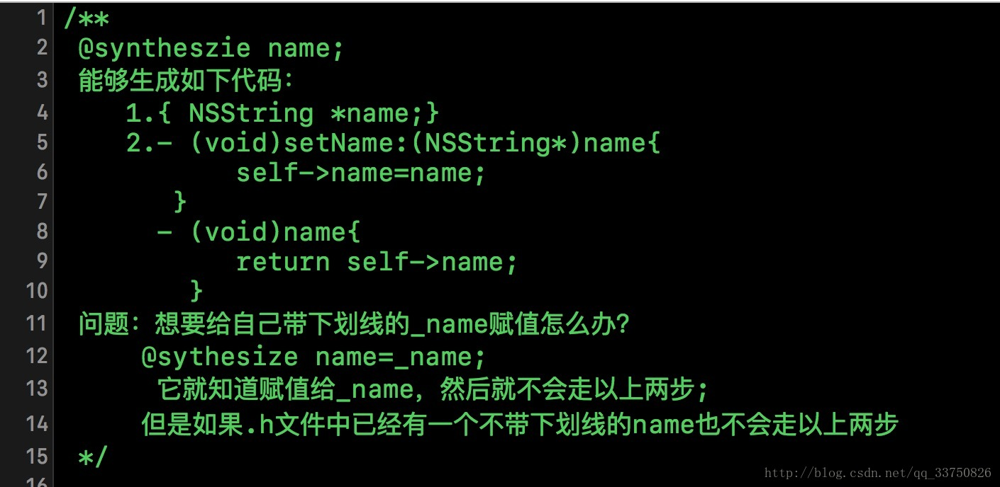

XCode4.4之后：

Person.h

    @interface Person : NSObject
    
    
    @property NSString *name;
    @property int age;
    @property int sex;
    
    @end

Person.m

    #import <Foundation/Foundation.h>
    #import "Person.h"
    
    @implementation Person
    
    
    @end

main.m:

    #import <Foundation/Foundation.h>
    #import "Person.h"
    
    int main(int argc, const char * argv[]) {
        @autoreleasepool {
            Person *p=[Person new];
            //这步能够调用，证明@property生成了set和get方法的声明
            p.name=@"张三";
            p.age=10;
            p.sex=1;
            //证明@synthesize生成了set和get的实现
            NSLog(@"name=%@,age=%d,sex=%d",p.name,p.age,p.sex);
        }
        return 0;
    }
    

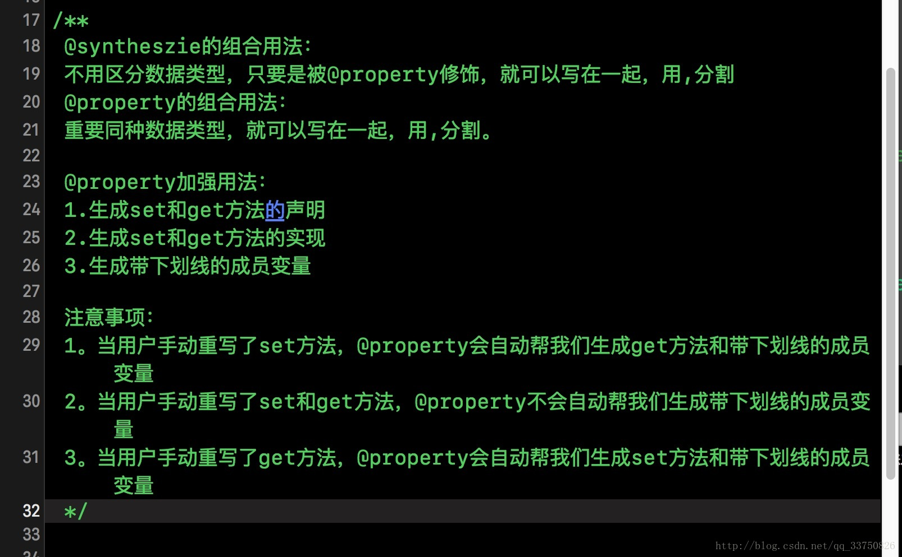

* * *

十九、了解动态类型和静态类型：
===============

> 动态类型：程序知道执行时才能确定所属类，多态。Animal *anl=\[Cat new\];  
> 静态类型：将一个变量定义为特定类对象时，使用的是静态形态。Animal *anl\[Animal new\];

* * *

二十、id类型的使用
==========

> id :万能指针  
>      能够指向任何OC对象  
>      id自带*。

例如：  
main.m

    
    #import <Foundation/Foundation.h>
    #import "Cat.h"
    #import "Animal.h"
    
    int main(int argc, const char * argv[]) {
        @autoreleasepool {
            Animal *cat = [Cat new];
            [(Cat *)cat jump];
    
            NSObject *obj=[Cat new];
            [(Cat*)obj jump];
    
            //编译器对NSObject做类型检测，但是不对id做类型检测
            //所以id不用强制类型转换也可以运行成功，编译也报警告。
            id c=[Cat new];
            [c jump];
        }
    
    
        return 0;
    }
    

id用法：  
1.作为参数  
2.作为成员变量

* * *

二十一、动态类型检测
==========

对象在运行时获取其类型的能力称为内省。内省有很多方法可以实现：  
main.m

    #import <Foundation/Foundation.h>
    #import "DogSon.h"
    
    int main(int argc, const char * argv[]) {
        @autoreleasepool {
            //1.判断对象是不是指定类对象或者指定类的子类对象
            Class dog=[Dog class];
            DogSon *son=[DogSon new];
            BOOL res=[son isKindOfClass:dog];
            NSLog(@"iskindOfClass：%d",res);
    
            //2.判断对象是不是1个特定类型的对象，不包括子类，父类
            Class dog1=[Dog class];
            DogSon *son1=[DogSon new];
            res=[son1 isMemberOfClass:dog1];
            NSLog(@"isMemberOfClass：%d",res);
    
            //3.判断1个类是不是另外一个类的子类
            Class dog2=[Dog class];
            res=[DogSon isSubclassOfClass:dog2];
            NSLog(@"isSubclassOfClass：%d",res);
    
            //4.判断对象中是否能响应指定的方法，这个最常用
            SEL sel=@selector(play);
            Dog *son2=[DogSon new];
            res=[son2 respondsToSelector:sel];
            NSLog(@"respondsToSelector：%d",res);
    
            //5.判断类中是否能响应指定方法
            sel=@selector(play);
            res=[Dog instancesRespondToSelector:sel];
            NSLog(@"respondsToSelector：%d",res);
        }
        return 0;
    }
    

结果：  
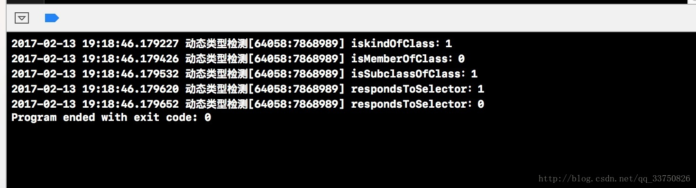

* * *

二十二、构造方法
========

Dog.h

    #import <Foundation/Foundation.h>
    
    @interface Dog : NSObject
    {
        @public
        NSString *_name;
        int _age;
    }
    -(instancetype)initWithName:(NSString*)name withAge:(int)age;
    @end
    

Dog.m

    #import "Dog.h"
    
    @implementation Dog
    
    /**
     重写构造方法
    
    - (instancetype)init
    {
        self = [super init];
        if (self) {
            //子类的初始化等等其他操作，在这个花括号里做。
        }
        return self;
    }
    
     */
    
    
    //自定义构造方法
    -(instancetype)initWithName:(NSString*)name withAge:(int)age{
        if ([super init]) {
            _age=age;
            _name=name;
        }
        return  self;
    }
    
    @end
    

main.m

    /**
     new一下，就能有一个对象
     1.分配内存空间
     2.初始化
    
     构造方法：指的就是初始化方法
     */
    
    #import <Foundation/Foundation.h>
    #import "Dog.h"
    
    int main(int argc, const char * argv[]) {
        @autoreleasepool {
            Dog *dog=[[Dog alloc] initWithName:@"旺财" withAge:1];
            NSLog(@"name=%@,age=%d",dog->_name,dog->_age);
        }
        return 0;
    }
    

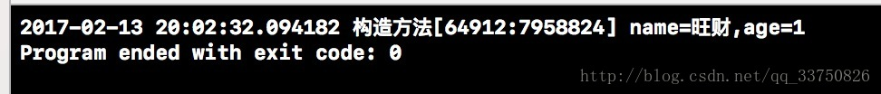

* * *

二十三、计数器的使用
==========

Person.h

    #import <Foundation/Foundation.h>
    
    @interface Person : NSObject
    
    @end
    

Person.m

    #import "Person.h"
    
    @implementation Person
    - (void)dealloc
    {
        //对象只要调用该方法，就代表对象即将被释放
        NSLog(@"我被杀了");
    
        //重写该方法，就必须调回父类的方法
        [super dealloc];
    }
    @end
    

main.m

    /**
     MRC:手动内存管理
     ARC:默认就是ARC automatic Refrence Count 自动引用计数器
    
     操作引用计数器的方法：
     1.retainCount:获得对象的引用计数器的值
     2.retain:能够让对象的计数器+1；
     3.release:让对象的计数器-1；
    
     怎么判断对象被释放？
     dealloc 只要调用此方法，就表明此对象将被释放
    
    僵尸对象:已经被释放的对象
    野指针：指向僵尸对象的指针
     空指针：指向nil的指针，给空指针发送消息（调用方法）不会报任何错误
    
     规定：谁relase谁retain
     */
    
    #import <Foundation/Foundation.h>
    #import "Person.h"
    
    int main(int argc, const char * argv[]) {
        @autoreleasepool {
            Person *person =[[Person alloc] init];
            //retainCount：能够输出对象引用计数器的值
            NSLog(@"%lu",person.retainCount);
            //那怎么知道对象被回收呢？重写父类的dealloc
            [person release];
            //为了防止后边调用某些方法会报错，此处赋值nil，给空指针发送任何消息都不会报错。
            person=nil;
            //如果该对象被回收，则下面会报错
            NSLog(@"%lu",person.retainCount);
        }
        return 0;
    }
    

* * *

二十四、多对象内存管理
===========

Gamer.h:

    
    #import <Foundation/Foundation.h>
    #import "House.h"
    
    @interface Gamer : NSObject
    {
        House *_house;
    }
    -(void)setHouse:(House*)house;
    -(House*)house;
    @end
    

Gamer.m

    #import "Gamer.h"
    
    @implementation Gamer
    
    - (void)dealloc
    {
        NSLog(@"玩家挂了");
        [_house release];
        [super dealloc];
    }
    -(void)setHouse:(House*)house{
        /**
         1.判断当是同一个房间的时候，就不再对计数器+1
         2.判断当进入不同的一个房间，首先把之前的房间给释放，然后再对新房间的计数器+1.
         */
        if(_house!=house){
            [_house release];
           _house= [house retain];
        }
    
    }
    -(House*)house{
        return _house;
    }
    
    @end
    

House.h

    #import <Foundation/Foundation.h>
    
    @interface House : NSObject
    {
    @public
        int _num;
    }
    @end
    

House.m

    #import "House.h"
    
    @implementation House
    
    - (void)dealloc
    {
        NSLog(@"%d房间挂了",_num);
        [super dealloc];
    }
    
    
    @end
    

main.m

    #import <Foundation/Foundation.h>
    #import "Gamer.h"
    
    int main(int argc, const char * argv[]) {
        @autoreleasepool {
            /**
             3.一个玩家再次进入同一个房间时，不用做任何操作，加入判断
             */
            Gamer *gamer=[[Gamer alloc] init];
            House *house=[[House alloc ] init];
            house->_num=10;
            gamer.house=house;
            gamer.house=house;
            [house release];
            [gamer release];
    
    
        }
        return 0;
    }
    
    /**
     一个玩家进入房间的情况，需要进入就对房间+1,出去之后就在dealloc中-1。
     */
    void one(){
        Gamer *gamer=[[Gamer alloc] init];
        House *house=[[House alloc ] init];
        house->_num=10;
        gamer.house=house;
        [gamer release];
    }
    
    /**
     一个玩家换房间的情况，在换房间之前必须把就房间给释放
     */
    void two(){
        Gamer *gamer=[[Gamer alloc] init];
        House *house=[[House alloc ] init];
        house->_num=10;
        House *house1=[[House alloc ] init];
        house1->_num=20;
        gamer.house=house;
        [house1 release];
        [house release];
        [gamer release];
    }
    
    
    

上面演示的是具体的多对象内存管理的过程，下面将介绍使用关键字的方式方便我们：

    @interface Gamer : NSObject
    //{
    //    House *_house;
    //}
    //-(void)setHouse:(House*)house;
    //-(House*)house;
    @property(retain)House *house;
    @end

只需要简单将

    @property(retain)House *house
    

添加，然后删除其他的，保存dealloc中的代码。

@property的参数：  
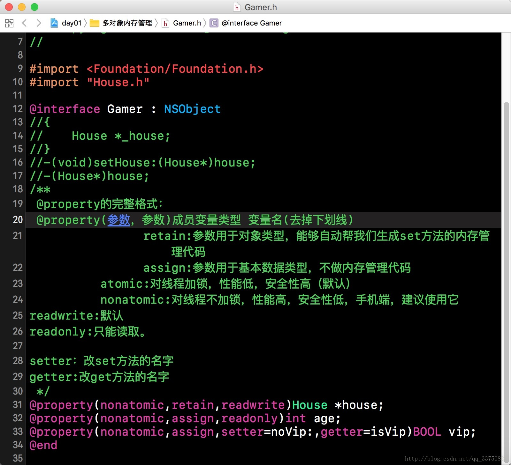

* * *

二十五、@class及其retain循环调用问题、NSString内存管理
=====================================

Gril.h

    #import <Foundation/Foundation.h>
    @class  Cat;
    @interface Gril : NSObject
    //对于循环retain的情况，对象不能使用retain,只能使用assign
    @property(nonatomic,assign)Cat *cat;
    
    @end

Gril.m

    #import "Gril.h"
    
    @implementation Gril
    - (void)dealloc
    {
        [_cat release];
        NSLog(@"女孩被抱走啦。。");
        [super dealloc];
    }
    @end
    

Cat.h

    #import <Foundation/Foundation.h>
    @class Gril;
    
    @interface Cat : NSObject
    
    @property(nonatomic,retain)Gril *gril;
    @end

Cat.m

    #import "Cat.h"
    
    @implementation Cat
    - (void)dealloc
    {
        [_gril release];
        NSLog(@"猫被干死了");
        [super dealloc];
    }
    @end

main.m

    /**建议以后头文件引入一个类的时候，使用@class
     import效率低
     当我们只需要这个类，而不关心类中定义的方法及其成员变量时使用@class
     两个文件相互#import会报错
     */
    
    #import <Foundation/Foundation.h>
    #import "Gril.h"
    #import "Cat.h"
    @class Dog;//仅仅告诉编译器Dog是一个狗类，可以声明一个对象
    //即使没有Dog类也不会不错
    
    
    int main(int argc, const char * argv[]) {
        @autoreleasepool {
            Gril *gril=[Gril new];
            Cat *cat=[Cat new];
            cat.gril=gril;
            gril.cat=cat;
    
            [gril release];
            [cat release];
        }
        return 0;
    }
    

> NSString的计数器大小是一个固定值，不能release也不能retain。

* * *

二十六、block的使用
============

    /**
     block用来保存一段代码
     block的标志：^
     block跟函数很像：
     1.可以保存代码
     2.有返回值
     3.有形参。
     4.调用方式一样
    
     block定义：
       返回值类型 (^变量名）(参数1变量类型，参数2变量类型) =^(参数1变量类型 参数1变量名,参数2变量类型 参数2变量名){操作代码};
    
     block访问外部变量：
     *block内部可以访问外面的变量
     *默认情况下,block不能修改外面的局部变量，给局部变量加上__block关键字，这个局部变量就可以在block内修改
     */
    
    #import <Foundation/Foundation.h>
    //使用typedef定义block
    typedef  int (^MyBlock)(int,int);
    int main(int argc, const char * argv[]) {
        @autoreleasepool {
            __block int c;
            //如果block没有形参，=后面可以将()省略
            void (^myBlock)()= ^{
                NSLog(@"---------------");
                NSLog(@"---------------");
            };
    
            MyBlock sumBlock = ^(int a,int b){
                c=a+b;
                return c;
    
            };
    
            NSLog(@"sumBlock(10,20):%d",sumBlock(10,20));
        }
        return 0;
    }
    

* * *

二十七、protocol的使用
===============

1.创建一个protocol.h：

    //定义了一个MyPerson的协议,NSObject是基协议
    @protocol MyPerson <NSObject>
    
    //@required 要求实现，不实现就会出现警告(默认是@required)
    @required
    -(void)test;
    -(void)test1;
    
    //@optional 不要求实现
    @optional
    -(void)test2;
    
    @end

2.创建一个类去遵守上面这个协议：Person.h

    /**
     :继承
     <>遵守协议
     */
    
    #import <Foundation/Foundation.h>
    #import "MyPerson.h"
    #import "MyProtocol.h"
    #import "MyProtocol2.h"
    
    @class Teacher;
    
    //只要遵守了协议，就拥有了该协议的所有方法。
    //遵守多个协议<1,2>,不可以多继承，可以遵守多个协议
    @interface Person : NSObject <MyPerson,MyProtocol>
    
    @property (nonatomic,strong)id<MyProtocol> teacher;
    @end
    

3。支持同时遵守多个协议，再创建MyProtocol.h

    //定义了一个MyPerson的协议
    @protocol MyProtocol <NSObject>
    
    //@required 要求实现，不实现就会出现警告(默认是@required)
    @required
    -(void)haha;
    
    //@optional 不要求实现
    @optional
    -(void)haha1;
    
    @end

4.用@required修饰的方法我们必须实现，实现之后不会报警告,Person.m

    
    #import "Person.h"
    
    @implementation Person
    -(void)test{
    
    }
    
    -(void)test1{
    
    }
    
    -(void)haha{
    
    }
    @end

5.子类继承Person，子类也遵守父类遵守的协议：  
Student.h

    
    #import "Person.h"
    
    //当一个类继承另一个类，如果该类中遵守了某个协议，那么子类也会遵守该协议，并也拥有该协议的所有方法。
    @interface Student : Person
    
    @end
    

5.Student.m中便可以直接实现协议中的方法  
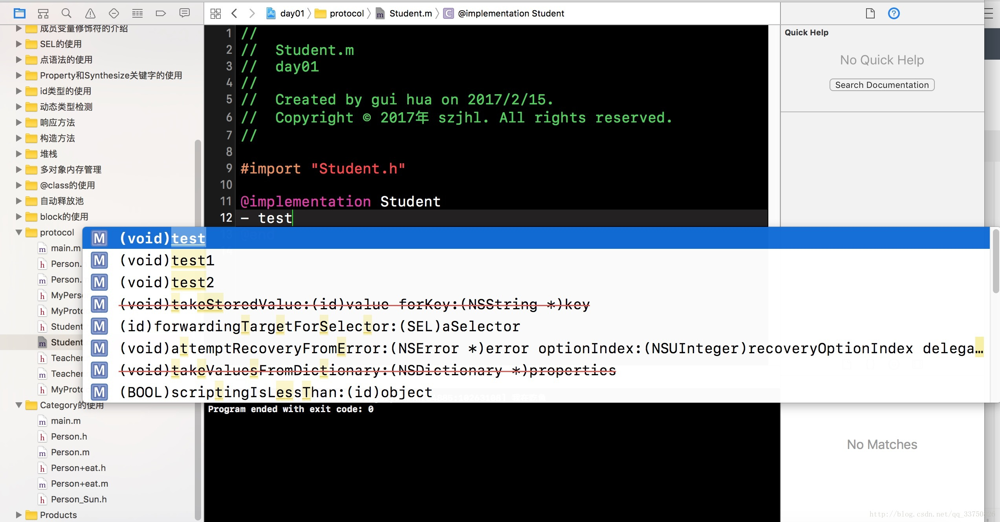

6.创建一个协议遵守另外一个协议MyProcotol2.h

    #import "MyPerson.h"
    //一个协议遵守了另外一个协议，该协议拥有另外一个协议的所有方法。
    @protocol MyProcotol2 <MyPerson>
    
    
    @end

7.创建一个类遵守MyProcotol2协议Teacher.h

    #import <Foundation/Foundation.h>
    #import "MyProtocol2.h"
    #import "MyProtocol.h"
    
    @interface Teacher :NSObject <MyProcotol2,MyProtocol>
    
    @end

8.可以看到Teacher.m中有协议中全部的方法：

    #import "Teacher.h"
    
    @implementation Teacher
    
    -(void)test{
    
    }
    
    -(void)test1{
    
    }
    -(void)haha{
    
    }
    
    @end
    

9.不能再协议中定义成员变量：  
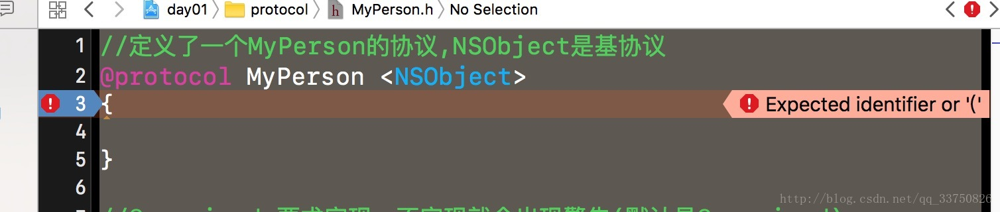  
10.在Person.h中我们定义了一个id类型的teacher，我们将他强制遵守了MyProtocol2协议，因此我们在未teacher时，那个值也必须遵守MyProtocol2协议：  
main.m

    /**
     @protocol用途
     1.不可以用来声明成员变量,只能用来声明方法
    
    当该协议只需给单个类遵守，可以将该协议定义在该类里面，如果需要给多个类遵守，就单独创个文件声明协议。
    
     */
    
    #import <Foundation/Foundation.h>
    #import "MyPerson.h"
    #import "Person.h"
    #import "Student.h"
    #import "Teacher.h"
    
    int main(int argc, const char * argv[]) {
        @autoreleasepool {
    
            //obj遵守协议MyPerson
            NSObject<MyPerson> *obj=[[Person alloc] init];
            obj=nil;
    
            //person遵守协议MyPerson,并继承Person
            Person<MyPerson> *person=[[Student alloc] init];
            person=nil;
    
            Teacher *teacher =[[Teacher alloc] init];
    
            Person *person2=[[Person alloc] init];
            person2.teacher=teacher;
    
        }
        return 0;
    }
    

11..h中只是对Protocol进行了声明，没有使用它里面的方法，所以我们可以在.h中使用

    
    @protocol  MyPerson;
    @protocol MyProtocol;

和@class一个道理，那么在.m中如果需要使用它的方法，这个时候我们就应该使用

    
    #import "MyPerson.h"
    #import "MyProtocol.h"
    #import "MyProtocol2.h"

12.如果我们只有一个类需要遵守这个协议那么，我们建议将协议和类的实现或者声明写在一起：

    
    #import <Foundation/Foundation.h>
    #import "Worker.h"
    
    @protocol MyProtocol3 <NSObject>
    -(void)test;
    @end
    @implementation Worker
    
    
    
    @end

* * *

二十八、Category（分类）的使用
===================

创建一个类，Person.h

    #import <Foundation/Foundation.h>
    
    @interface Person : NSObject
    {
        @protected
        int _age;
        @public
        int _sex;
        @private
        int _num;
    }
    @property (nonatomic,retain)NSString *name;
    @end

Person.m

    #import "Person.h"
    
    @implementation Person
    
    @end

2.我们在创建Person的分类：Person+eat.h:

    #import "Person.h"
    
    @interface Person (eat)
    {
       // int eat;//分类中不能定义成员变量
    }
    //会生成set和get方法，但是不会生成带_的成员变量，不建议写
    //@property (nonatomic,assign)int age;
    - (void) eatFish;
    
    @end

3.实现eatFish:Person+eat.m:

    #import "Person+eat.h"
    
    @implementation Person (eat)
    
    -(void)eatFish{
        _age=10;
    
        NSLog(@"我在吃%d只鱼",_age);
    }
    @end

4.可以看到分类只能访问@protected和@public修饰的成员变量  
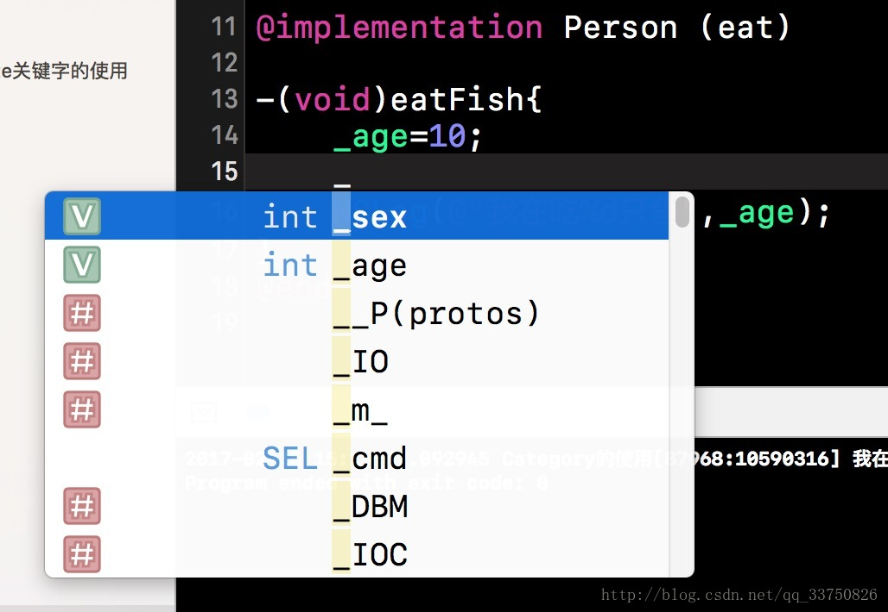

5.调用分类中的方法：

    /**
     当本类和分类有相同的方法时，优先调用分类中的方法
     分类中可以访问本类中的成员变量，但是仅限于@protected,@public
     分类和子类一样，不能访问本类中的@private修饰的成员变量
    
     分类主要的作用：是给系统自带的类扩展方法。
     */
    
    #import <Foundation/Foundation.h>
    #import "Person.h"
    #import "Person+eat.h"
    
    int main(int argc, const char * argv[]) {
        @autoreleasepool {
            Person *person=[[[Person alloc] init ] autorelease];
            [person eatFish];
        }
        return 0;
    }
    

我们可以看到直接使用本类调用分类中方法是可以直接调用的：  
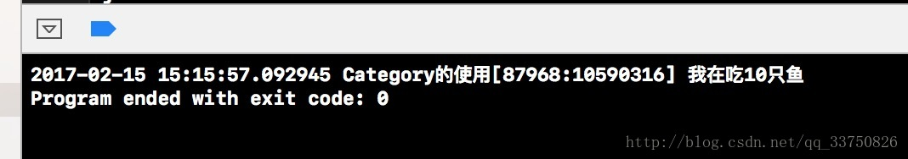

6.我们创建1个类继承Person，看看子类是否能够调用父类中分类的方法：

Student.h

    #import "Person.h"
    
    @interface Student : Person
    -(void)test;
    @end

Student.m

    
    #import "Student.h"
    #import "Person+eat.h"
    
    @implementation Student
    -(void)test{
        [super eatFish];
    }
    @end

main.m

      Student *student=[[[Student alloc]init]autorelease];
            [student test];
    

可以看到子类是可以调用父类分类的方法

7、当我们本类和父类拥有相同方法时，首先调用分类的方法：

* * *

二十九、类扩展的使用
==========

1.创建Person.h

    #import <Foundation/Foundation.h>
    
    @interface Person : NSObject
    {
        @protected
        int _age;
        @public
        int _sex;
        @private
        int _num;
    }
    @property (nonatomic,retain)NSString *name;
    @end

2.创建1个类扩展：Person_Sun.h

    /**
     能够扩展类的成员变量和方法
     正常类的声明格式：@interface 类名：NSObject
         分类格式：@interface 类名（分类名称）
         类扩展：@interface 类名()
     */
    
    #import "Person.h"
    
    @interface Person ()
    {
        @public
        int _height;
    }
    -(void)run;
    @end

3.因为类扩展只要.h文件，所以我们只能在Person.m中实现

    #import "Person.h"
    #import "Person_Sun.h"
    
    @implementation Person
    - (void)run{
        _name=@"张三";
        _height=30;
        _weight=40;
        _age=10;
        _sex=20;
        NSLog(@"%@在跑跑跑",_name);
    }
    

4.可以看到run方法能访问本类中的所有成员变量，我们在main.m中运行

    #import <Foundation/Foundation.h>
    #import "Person.h"
    #import "Person_Sun.h"
    
    int main(int argc, const char * argv[]) {
        @autoreleasepool {
            Person *person=[[[Person alloc] init ] autorelease];
            [person run];
            person->_height=20;    }
        return 0;
    }
    

5.以上方式通过创建了一个文件，不能达到方法和成员变量真正的私有，下面演示怎么私有：  
Person.m

    /**
     类创建的第二种方式：@interface 类名()
                      里面可以声明成员变量
                     里面可以声明方法，类扩展声明的方法，必须实现
                     @end
     这种创建类扩展的方式，是真正的私有
     这种私有，子类无法通过任何方式访问父类中类扩展的方法和成员变量
     */
    
    #import "Person.h"
    //这种在.m中创建的类扩展，最常用,真正私有
    @interface Person()
    {
        NSString *_name;
        int _age;
    }
    @property (nonatomic,assign)int _sex;
    
    -(void)show;
    
    @end
    
    
    @implementation Person
    -(void)show{
        _age=20;
        _name=@"张三";
        NSLog(@"%d的%@在泡泡跑",_age,_name);
    }
    @end
    

6.外界访问类扩展：  
main.m

    #import <Foundation/Foundation.h>
    #import "Person.h"
    
    int main(int argc, const char * argv[]) {
        @autoreleasepool {
            Person *person =[[[Person alloc] init]autorelease];
           // person->_name;私有成员变量，外界无法直接访问
            //[person show];私有方法，外界无法直接访问
            //person->_sex;在.m的类扩展文件中，使用@property修饰的成员变量，外界仍然无法访问。
        }
        return 0;
    }
    

7.查看子类是否能使用类扩展中的方法和成员变量  
GoodPerson.h

    #import "Person.h"
    
    @interface GoodPerson : Person
    -(void)test;
    @end

8.可以看到GoodPerson.m无法调用喝访问父类中类扩展的成员变量和方法

    #import "GoodPerson.h"
    
    @implementation GoodPerson
    /**
     1.子类不能访问父类类扩展中的成员变量
     2.子类不能访问父类类扩展中的方法
     3.子类不能访问父类类扩展中用@property修饰的成员变量。
     */
    -(void)test{
    
    }
    @end
    

* * *

三十、分类和类扩展的区别：
=============

> 1.分类中只能增加方法  
> 2.类扩展不仅可以增加方法，还可以增加成员变量，只是该成员变量是私有的，作用范围只在自身类，而不再子类或者其他类。  
> 3.类扩展不能像分类那样拥有独立的部分(@implementation)也就是说，类扩展中声明的方法，必须依托对应的本类的.m文件来实现  
> 4.定义在.m文件中的类扩展的成员变量和方法是私有的，定义在.h文件中的类扩展的成员变量和属性是公有的，类扩展是.m文件中声明私有方法非常好的方式。

* * *

三十一、autorelease的使用及其自动释放池的介绍
============================

main.m

    /**
     自动释放池的作用：
        1>对池子里面所有的对象，在池子被释放的时候，统一做一次release操作。前提：调用autorelease，当池子释放时，才会对对象做release操作
        2>当一个对象调用autorelease方法时，会将这个对象放到栈顶的释放池
    
     1.autorelease的基本用法：
        1>autorelease会将对象放入自动释放池
        2>调用玩autorelease方法后，对象的计数器不会+1;
        3>调用autorelease回返回对象本身
        4>当自动释放池被销毁时，会对池子里面的所有对象做一次release操作
    
     2.autorelease的好处：
       1>不用在关心对象释放的时间
       2>不用再关心什么时候调用release
    
     3.autorelease的使用注意：
     1>占用内存大的对象不要随便使用autorelease
     2>占用内存小的兑现更实用autorelease，没有太大影响
    
     4.自动释放池的创建方式：
         1>iOS 5.0前：
           NSAutoreleasePool *pool=[[NSAutoreleasePool alloc] init];
           Person *person =[[[Person alloc] init] autorelease];
           [pool release];
           // [pool drain];
    
        2>iOS 5.0后：
           @autoreleasepool{
    
           }
    
    
     5.系统自带的方法没有包含alloc，new，copy，所明返回的对象都是autorelease的
    
    6. 开发中经常会提供一些类方法，快速创建一个已经autorelease的对象
    
     */
    
    #import <Foundation/Foundation.h>
    #import "Person.h"
    
    int main(int argc, const char * argv[]) {
    
    
        //以栈的结构进行存储的，先进后出
        @autoreleasepool {//开始代表创建了一个释放池
            Person *person =[[[Person alloc] init] autorelease];
            person.age=10;
            @autoreleasepool {
                Person *person =[[[Person alloc] init] autorelease];
                person.age=20;
                @autoreleasepool {
                    Person *person=[Person person];
                    person.age=30;
                }
            }
    
        }//出了花括号，会对池子里面的所有调用了autorelease方法的对象做一次release操作。
        return 0;
    }
    

Person.m

    #import "Person.h"
    
    @implementation Person
    - (void)dealloc
    {
        NSLog(@"%d，dealloc",_age);
        [super dealloc];
    }
    
    //方便对象释放
    //创建对象时，不要直接用类名，一般用self.
    +(id)person{
        return [[[self alloc] init] autorelease];
    }
    
    //方便释放的同时给属性初始化
    +(id)personWithAge:(int)age{
        Person *person= [self person];
        person.age=age;
        return person;
    }
    @end
    

Person.h

    #import <Foundation/Foundation.h>
    
    @interface Person : NSObject
    @property (nonatomic,assign)int age;
    +(id)person;
    +(id)personWithAge:(int)age;
    @end
    

* * *

三十二、ARC
=======

Person.h

    #import <Foundation/Foundation.h>
    @class Dog;
    @interface Person : NSObject
    @property (nonatomic,strong)Dog *dog;
    @property (nonatomic,weak)Dog *dog2;
    @property (nonatomic,strong)Dog *dog3;
    @end
    

Person.m

    #import "Person.h"
    
    @implementation Person
    - (void)dealloc
    {
        NSLog(@" Person dealloc.....");
    }
    @end

Dog.h

    #import <Foundation/Foundation.h>
    @class Person;
    @interface Dog : NSObject
    @property (nonatomic,weak) Person* person;
    @end

Dog.m

    
    #import "Dog.h"
    
    @implementation Dog
    - (void)dealloc
    {
        NSLog(@" Dog dealloc.....");
    }
    @end

main.m

    /**
     ARC的判断准则：只要没有强指针指向对象，就会释放对象
    
     1.ARC特点：
       1>不允许调用release、retain、retainCount
       2>允许重写dealloc，但是不允许调用[super dealloc]
       3>@property的参数
          strong:成员变量是强指针（适用于OC对象类型）
          weak：成员变量是弱指针（适用于OC对象类型）
          assign:适用于非OC对象类型
       4>以前的retain改为strong
    
     指针分2种
     1>强指针：默认情况下，所有指针都是强指针 __strong
     2>弱指针：__weak
    
     当两端循环引用时候，解决方案：
       1>ARC
       1端用strong，另1端用weak
    
       2>非ARC
       1端用retain,另1端用assign
     */
    
    #import <Foundation/Foundation.h>
    #import "Person.h"
    #import "Dog.h"
    
    
    int main(int argc, const char * argv[]) {
        @autoreleasepool {
            //对于循环strong，必须一端strong，一段weak;
            Person *p=[[Person alloc]init];
            Dog *dog=[[Dog alloc] init];
            p.dog=dog;
            dog.person=p;
        }
        return 0;
    }
    
    void test(){
        //弱指针指向对象立马会被回收，所以下面p为null
        __weak Person *p=[[Person alloc]init];
        NSLog(@"%@",p);
    
        //默认就是强指针__strong，所以下面p2有地址值,出了大括号之后才被回收
        Person *p2=[[Person alloc]init];
        NSLog(@"%@",p2);
    
        //因为Dog在Person中是strong修饰的，所以出了大括号才被回收
        Dog *dog=[[Dog alloc] init];
        p2.dog=dog;
    
    
    
        //因为dog2是weak修饰的，所以会跟着dog的释放一起释放。
        p2.dog2=dog;
    
        //这时候将dog和dog2都改为nil，将2个强指针释放了，那么dog2也会释放，所以他下面的地址打印为null
        dog=nil;
        p2.dog=nil;
        NSLog(@"%@..",p2.dog2);
    
        //因为dog3也是strong强指针，所以到了大括号和dog一起释放
        dog=[[Dog alloc] init];
        p2.dog3=dog;
        NSLog(@"%@..",p2.dog3);
    
        NSLog(@"------");
    }
    

ARC的转换：  
1.当所有的类都是开放的时候：  
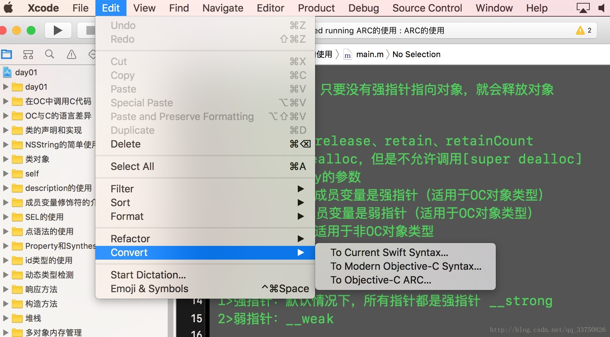

2.当有.a文件含有非ARC的方法不能全部转换时：  
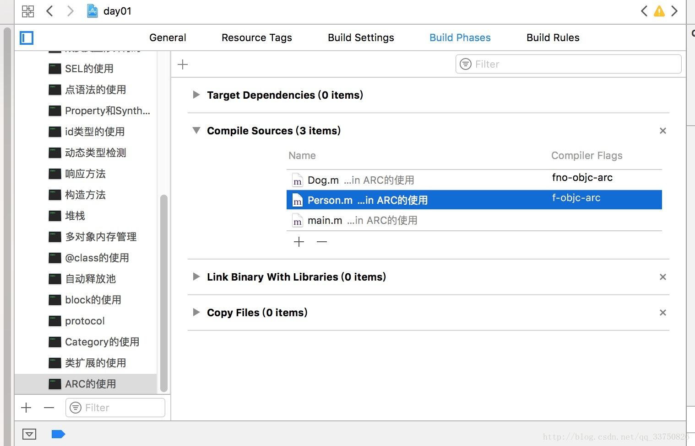

* * *

三十三、NSString方法的使用
=================

    #import <Foundation/Foundation.h>
    
    void demo();
    
    //声明一个成员变量
    extern int a;
    static int b;
    void demo2(){
        b++;
        a++;
        NSLog(@"A:%d...",a);
        NSLog(@"B:%d,,,.",b);
    
    }
    
    NSString* scanNSString(){
        //getchar()函数，从输入流中获取一个字符，并返回其ASCII码
    
        char arr[256];
        int length=0;
        char ch;
        while ((ch=getchar())!='\n') {
            arr[length]=ch;
            length++;
        }
        arr[length]='\0';
        return [[NSString alloc] initWithUTF8String:arr];
    }
    
    int main(int argc, const char * argv[]) {
        @autoreleasepool {
            //使用NSError，首先定义一个NSError的指针变量，不用赋值
            NSError *err;
            //从文件读取字符串
            NSString *fileStr=[[NSString alloc]initWithContentsOfFile:@"/Users/guihua/OC学习/Day02/Day02/main.m" encoding:NSUTF8StringEncoding error:&err];
            //如果err为空，err=null,即0，则正确
            //如果出现了错误，err中就会被赋值，它就会指向一个错误对象，即!err就是假
            if (!err) {
               // NSLog(@"%@",fileStr);
            }
    
            NSError *urlErr;
            NSURL *url=[[NSURL alloc] initWithString:@"http://www.baidu.com"];
            //从url读取字符串
            NSString *urlStr=[[NSString alloc] initWithContentsOfURL:url encoding:NSUTF8StringEncoding error:&urlErr];
            if (!urlErr) {
                // NSLog(@"%@",urlStr);
            }
    
            //格式化字符串输出：
            NSString *formatStr=[[NSString alloc] initWithFormat:@"%d+%d=%d",1,2,1+2];
         //   NSLog(@"formatStr:%@",formatStr);
    
            //从控制台输出字符串并打印
         //   while (1) {
               // printf("$");
              //  NSString *str=scanNSString();
              //  NSLog(@"%@",str);
           // }
    
            //比较：
            NSString *equalStr=@"123";
            NSString *equalStr2=@"121";
            NSString *equalStr3=@"44";
            NSString *equalStr4=@"abc";
            BOOL isequal=[equalStr isEqualToString:equalStr2];
            BOOL isequal1=[equalStr isEqualToString:equalStr3];
        //    NSLog(@"isEqualToString : %d----%d",isequal,isequal1);
            BOOL isequal2=[equalStr isEqual:equalStr2];
            BOOL isequal3=[equalStr isEqual:equalStr3];
         //   NSLog(@"isEqual : %d----%d",isequal2,isequal3);
            BOOL isequal4=[equalStr isEqualTo:equalStr2];
            BOOL isequal5=[equalStr isEqualTo:equalStr3];
         //   NSLog(@"isEqual : %d----%d",isequal4,isequal5);
    
    
            /**
             如果第一个字符串大于第二个字符串，返回1
             如果第一个字符串小于第二个字符串，返回-1
             如果第一个字符串等于第二个字符串，返回0
             */
            BOOL compare=[equalStr compare:equalStr2];
            BOOL compare1=[equalStr compare:equalStr3];
            BOOL compare2=[equalStr3 compare:equalStr4];
            BOOL compare3=[equalStr compare:equalStr4];
          //  NSLog(@"compare : %d...%d.....%d....%d",compare,compare1,compare2,compare3);
    
    
           //查找字符串中某子字符串
            NSString *queryStr=@"fahfoahfahfa;idfhga";
    
            for (int i=0; i<[queryStr length]; i++) {
                char ch=[queryStr characterAtIndex:i];
                if (ch=='f') {
    
                }
            }
      //     demo();
            //因为之前是声明，后面赋值，所以输出的还是赋值的值,10
      //      NSLog(@"%d...",a);
            demo2();
             demo2();
             demo2();
            /**
    
             */
    
        }
        return 0;
    }
    int a=10;
    

    #import <Foundation/Foundation.h>
    
    int main(int argc, const char * argv[]) {
        @autoreleasepool {
            //
            NSString *str=@"www.itcast.com";
    
            //得到一个子字符串
            /**
             location：截取的起始位置(包含该索引) 
             length：截取的长度
             */
            NSRange range={4,6};
            NSString *rangeStr=[str substringWithRange:range];
            NSLog(@"substringWithRange:%@",rangeStr);
    
            //2.获取一个字符串在这个字符串的位置
            NSString *subString=@"]";//@"itcast";
            NSRange rangeSub=[str rangeOfString:subString];
            if (rangeSub.location==NSNotFound) {
                NSLog(@"subString不在str中");
            }else{
                //NSStringFromRange打印一个NSRange
                NSLog(@"rangeOfString：%@",NSStringFromRange(rangeSub));
            }
    
            //3.判断字符串是否已指定的内容开头
            NSLog(@"hasPrefix:%@",[str hasPrefix:@"x"]?@"YES":@"NO");
    
            //判断字符串是否已指定的内容结尾.
            NSString *suffixStr=@"a.txt";
            NSLog(@"suffix:%@",[suffixStr hasSuffix:@"txt"]?@"YES":@"NO");
    
            //4.==比较的是字符串地址，isEqualString比较的是字符串值
    
    
            //5.将字符串转换成基本数据类型，如果字符串不是基本数据类型返回的而是给基本类型的未初始化的值
            NSString *intStr=@"i21";
            float strInt=[intStr floatValue];
            NSLog(@"intValue:%f",strInt);
    
            //6.将字符转换成大写
            NSString *caseStr=@"你好abD";
            NSLog(@"uppercaseString:%@",[caseStr uppercaseString]);
    
            //7.将字符串转换成小写
            NSLog(@"lowercaseString:%@",[caseStr lowercaseString]);
    
            //8.将字符串首字母转换成大写，这个函数会自动将不是首字母的变成小写。
            NSLog(@"capitalizedString:%@",[caseStr capitalizedString]);
    
            //9.在指定范围增加字符串
            NSString *appendStr=@"www.cn";
            NSRange rangeAppend={4,0};
            NSLog(@"replce：%@",[appendStr stringByReplacingCharactersInRange:rangeAppend withString:@"itcast."]);
    
            //10.将字符串写入文件
            NSString *fileStr=@"我在上班啊，你好啊";
            NSString *path=@"/Users/guihua/OC学习/Day02/nihao.txt";
            NSError *fileError;
            [fileStr writeToFile:path atomically:YES encoding:NSUTF8StringEncoding error:&fileError];
            if (fileError!=nil) {
                NSLog(@"%@",fileError);
            }else{
                NSLog(@"字符串写入文件成功");
            }
    
            //11.读取文件中的字符串
            NSError *readError;
            NSString *readStr=[NSString stringWithContentsOfFile:path encoding:NSUTF8StringEncoding error:&readError];
            if (readError!=nil) {
                NSLog(@"%@",readError);
            }else{
                NSLog(@"%@",readStr);
            }
    
            //12，可变长度字符串
            NSMutableString *mutableStr=[[NSMutableString alloc]initWithCapacity:0];
            [mutableStr setString:@"www."];
            [mutableStr appendString:@".cn"];
            NSLog(@"appendString:%@",mutableStr);
            [mutableStr insertString:@"itcase" atIndex:4];
            NSLog(@"insertString:%@",mutableStr);
            NSRange mutableRange={4,6};
            [mutableStr deleteCharactersInRange:mutableRange];
            NSLog(@"insertString:%@",mutableStr);
            NSRange mutableRange2={0,3};
            [mutableStr replaceCharactersInRange:mutableRange2 withString:@"aaa"];
            NSLog(@"insertString:%@",mutableStr);
    
        }
        return 0;
    }
    

* * *

三十四、练习：一个字符串在另一个字符串中出现的次数
=========================

NSString+caculate.h

    #import <Foundation/Foundation.h>
    
    @interface NSString (caculate)
    -(int)caculateCount :(NSString*)subString;
    @end

NSString+caculate.m

    #import "NSString+caculate.h"
    
    @implementation NSString (caculate)
    -(int)caculateCount :(NSString*)subString{
        int count=0;
        NSRange range=[self rangeOfString:subString];
        if (range.location==NSNotFound) {
            return count;
        }
        NSString *subStr=self;
        while (range.location!=NSNotFound) {
            count++;
            subStr=[subStr substringFromIndex:(range.location+range.length)];
            range=[subStr rangeOfString:subString];
    
        }
        return count;
    }
    @end
    

main.m

    #import <Foundation/Foundation.h>
    #import "NSString+caculate.h"
    
    int main(int argc, const char * argv[]) {
        @autoreleasepool {
            NSString *desStr=@"abfahdsfhbc1424bc";
            NSString *subStr=@"abc";
            int count=[desStr caculateCount:subStr];
            NSLog(@"%d",count);
        }
        return 0;
    }
    

* * *

三十五、数组的基本使用
===========

    #import <Foundation/Foundation.h>
    #import "Person.h"
    
    int main(int argc, const char * argv[]) {
        @autoreleasepool {
            // 1.创建数组
            //NSArray是不可变数组，一但创建完成就不能对数据进行添加、删除等操作
            NSArray *array=[[NSArray alloc] init];
            NSLog(@"array:%@",array);
    
            //2.通过构造方法创建一个NSArray，在创建一个NSArray的时候最后一个元素一定是nil
            NSArray *arr=[NSArray arrayWithObjects:@"one",@"two",nil];
            NSLog(@"arr:%@",arr);
    
            //3.数组中可以储存不同类型的元素
            NSNumber *number=[NSNumber numberWithInt:10];
            NSArray *arr2=[NSArray arrayWithObjects:@"three",@"four",number,nil];
            NSLog(@"arr2:%@",arr2);
    
            //4.数组中实际上存储的是数组的地址
            NSArray *arr3=[NSArray arrayWithObjects:@"three",@"four",@"five",nil];
            NSArray *arr4=[NSArray arrayWithObjects:@"1",@"2",@"3",nil];
            NSArray *arr5=[NSArray arrayWithObjects:arr3,arr4,nil];
            NSLog(@"arr5:%@",arr5);
    
            //5.存储自定义对象
            Person *p=[[Person alloc] initWithName:@"zhangsan" andAge:20];
            Person *p1=[[Person alloc] initWithName:@"lisi" andAge:30];
            NSArray *arr6=[NSArray arrayWithObjects:p,p1,nil];
            NSLog(@"arr6:%@",arr6);
    
            //6.如果要在数组中存储基本数据类型，必须包装成NSNumber在去存
            //注意不要把nil存储到数组中，否则可能会造成数据丢失
            NSNumber *num=[NSNumber numberWithInt:10];
            NSArray *arr7=[NSArray arrayWithObjects:num,nil];
            NSLog(@"arr7:%@",arr7);
    
            //7.创建数组的快捷方式：不用写nil结尾
            NSArray *arr8=@[@"a",@"b",@"c"];
            NSLog(@"arr8:%@",arr8);
            NSLog(@"arr8[1]:%@",arr8[1]);
    
    #pragma mark 从集合中取出来
            {
                //8.从数组中取出数据
                NSArray *arr=@[@"a",@"b",@"c"];
                NSLog(@"arr:%@",[arr objectAtIndex:1]);
    
                //9.数组的长度
    
                NSLog(@"arrCount:%ld",[arr count]);
    
                Person *p=[[Person alloc] initWithName:@"zhangsan" andAge:20];
                Person *p1=[[Person alloc] initWithName:@"lisi" andAge:30];
                NSArray *arr1=@[p,p1];
    
                NSLog(@"arr1 containsObject:%d",[arr1 containsObject:p]);
    
                //10.firstObject lastObject
                NSLog(@"firstObject:%@,%@",[arr firstObject],arr[0]);
                NSLog(@"lastObject:%@,%@",[arr lastObject],arr[[arr count]-1]);
    
                //11.indexOfObject
                NSUInteger a1=[arr indexOfObject:@"1"];//NSNotFound
                NSUInteger a2=[arr indexOfObject:@"b"];
                NSLog(@"%ld,%ld",a1,a2);
    
    
            }
    
        }
        return 0;
    }
    

Person.h

    #import <Foundation/Foundation.h>
    
    @interface Person : NSObject
    @property (nonatomic,strong) NSString* name;
    @property (nonatomic,assign)int age;
    -(id) initWithName:(NSString *)name andAge:(int)age;
    @end

Person.m

    #import "Person.h"
    
    @implementation Person
    -(id) initWithName:(NSString *)name andAge:(int)age{
        if (self=[super init]) {
            _age=age;
            _name=name;
        }
        return self;
    }
    
    - (NSString *)description
    {
        return [NSString stringWithFormat:@"name=%@,age=%d", _name,_age];
    }
    @end
    

* * *

三十六、数组的遍历
=========

    #import <Foundation/Foundation.h>
    typedef void (^myBlock) (int index,id obj,BOOL *stop);
    @interface NSArray (enumerateExtension)
    -(void)bianli:(myBlock)block;
    @end
    @implementation NSArray (enumerateExtension)
    -(void)bianli:(myBlock)block{
        BOOL stop=NO;
        for(int i=0;i<self.count;i++){
            if (stop) {
                break;
            }
            block(i,self[i],&stop);
        }
    }
    
    @end
    
    int main(int argc, const char * argv[]) {
        @autoreleasepool {
            //1.传统for循环
            NSArray *arr=@[@"a",@"b",@"c",@"d"];
            for(int i=0 ;i<arr.count;i++){
                NSLog(@"%@",arr[i]);
            }
    
            /**
             2.for-in循环
             基本语法：for(临时变量 in 数组){
                 NSLog(@"%@",临时变量);
             }
             特点：
             1>要么使用break退出，要么全部打印
             2>临时变量的值不能更改
    
             item又称为迭代变量，for-in循环又叫快速枚举
             */
            for(NSString *item in arr){
                NSLog(@"%@",item);
            }
    
            //3.利用block遍历数组(enumerate)
            [arr enumerateObjectsUsingBlock:^(id  obj, NSUInteger idx, BOOL *  stop) {
    
                NSLog(@"arr[%lu]:%@",idx,obj);
                 *stop=YES;
            }];
    
            [arr bianli:^(int index, id obj, BOOL *stop) {
                *stop=YES;
                NSLog(@"arr[%lu]:%@",index,obj);
            }];
    
        }
        return 0;
    }
    

* * *

三十七、数组的文件读写
===========

    /**
     数组在写入文件之后，会被格式化成XML文件，这个文件的后缀名设置为.plist后，
     可以被XCode使用,plist又叫属性列表文件 Property list.
     */
    
    #import <Foundation/Foundation.h>
    
    int main(int argc, const char * argv[]) {
        @autoreleasepool {
            NSArray *arr=@[@"a",@"b",@"c"];
            [arr writeToFile:@"/Users/guihua/Desktop/a.txt"
                  atomically:YES];
            NSArray *arr2=[NSArray arrayWithContentsOfFile:@"/Users/guihua/Desktop/a.txt"];
            NSLog(@"%@",arr2);
            //字符串分割
            NSString *string=@"1,2,3,4,5,6,7";
            NSArray *arr3=[string componentsSeparatedByString:@","];
            NSLog(@"%@",arr3);
            //拼接元素
            NSArray *arr4=@[@"2017",@"02",@"20"];
            NSString *str=[arr4 componentsJoinedByString:@"-"];
            NSLog(@"%@",str);
    
        }
        return 0;
    }
    

* * *

三十八、可变数组
========

    #import <Foundation/Foundation.h>
    
    int main(int argc, const char * argv[]) {
        @autoreleasepool {
            //1.构造方法
            //NSMUtableArray *arr=[[NSMutableArray alloc] init];
            //或：
            NSMutableArray *arr=[NSMutableArray array];
    
            //2.添加元素
            [arr addObject:@"a"];
            [arr addObject:@"b"];
            NSLog(@"%@",arr);
    
            //3.在指定位置添加元素
            [arr insertObject:@"c" atIndex:2];
            NSLog(@"%@",arr);
    
            //4.修改元素
            [arr  replaceObjectAtIndex:0 withObject:@"A"];
            NSLog(@"%@",arr);
    
            //5.删除元素
            [arr removeObjectAtIndex:0];
            NSLog(@"%@",arr);
    
            //6.交换两个元素的位置
            [arr exchangeObjectAtIndex:0 withObjectAtIndex:1];
            NSLog(@"%@",arr);
    
            //7.
            /**
            NSMutableArray *array=@[@"1",@"2",@"3"];
            array =[NSMutableArray arrayWithArray:array];
            [array insertObject:@"4" atIndex:3];
            NSLog(@"%@",array);
    
             */
        }
        return 0;
    }
    

* * *

三十九、NSDictionary的使用
===================

    #import <Foundation/Foundation.h>
    
    int main(int argc, const char * argv[]) {
        @autoreleasepool {
            NSArray *arr1=@[@"1",@"2"];
            NSArray *arr2=@[@"yi",@"er"];
            NSDictionary *dic=[[NSDictionary alloc] initWithObjects:arr2 forKeys:arr1];
            NSLog(@"%@",dic);
    
            /**
             如果键不存在，返回null
             */
            NSString *str=@"32";
            for (int i=0; i<str.length; i++) {
                char ch=[str characterAtIndex:i];
                NSString *string=[NSString stringWithFormat:@"%c",ch];
                NSString *value=dic[string];
                NSLog(@"value:%@",value);
            }
    
            //可变键值对
            NSMutableDictionary *dictionary=[NSMutableDictionary dictionary];
            dictionary[@"box"]=@"盒子";
            dictionary[@"book"]=@"书";
            NSLog(@"%@",dictionary);
        }
        return 0;
    }
    

* * *

四十、NSFileManager
================

    #import <Foundation/Foundation.h>
    
    int main(int argc, const char * argv[]) {
        @autoreleasepool {
            NSFileManager *nsf=[NSFileManager defaultManager];
            BOOL isExist=[nsf fileExistsAtPath:@"/Users/guihua/Desktop/a.txt"];
            BOOL isDir;
            BOOL isFileDir=[nsf fileExistsAtPath:@"/Users/guihua/Desktop/a.txt" isDirectory:&isDir];
            NSLog(@"%d",isExist);
            NSLog(@"%d",isDir);
            NSLog(@"%d",isFileDir);
    
    #pragma mark NSFileManager高级用法
            //1.得到文件的特性
            NSDictionary *dic=[nsf attributesOfItemAtPath:@"/Users/guihua/Desktop/Xcode" error:nil];
            NSLog(@"获得文件的特性:%@",dic);
    
            //2.获得文件夹下的文件
            NSArray *arr=[nsf subpathsAtPath:@"/Users/guihua/Desktop/A"];
            NSArray *arr2=[nsf subpathsOfDirectoryAtPath:@"/Users/guihua/Desktop/A" error:nil];
            NSLog(@"获得文件夹下的所有文件：%@",arr);
            NSLog(@"获得文件夹下的所有文件：%@",arr2);
    
            /**
             3.创建文件
             如果文件存在会覆盖
             如果上层文件夹不存在不会创建
             */
            BOOL isCreate=[nsf createFileAtPath:@"/Users/guihua/Desktop/A/4/a.txt" contents:nil attributes:nil];
            NSLog(@"创建文件：%d",isCreate);
    
            /**
             4.创建文件夹
             如果文件夹下存在文件夹或者文件，不会新建，返回1
             第二个参数是一个BOOL类型，如果为no，当文件路径的前面几层都不存在，并不会新建，如果为yes，尽管前面几层不会存在也会新建。
             */
            BOOL isCreateDir=[nsf createDirectoryAtPath:@"/Users/guihua/Desktop/A/1" withIntermediateDirectories:YES attributes:nil error:nil];
            NSLog(@"创建文件夹：%d",isCreateDir);
    
            //4.复制文件
         //   BOOL isCopy=[nsf copyItemAtPath:@"/Users/guihua/Desktop/A/" toPath:@"/Users/guihua/Desktop/A/2/a" error:nil];
          //  NSLog(@"复制文件:%d",isCopy);
    
            //5.移动文件
            BOOL isMove=[nsf moveItemAtPath: @"/Users/guihua/Desktop/A/a.txt" toPath:@"/Users/guihua/Desktop/A/2/a.txt" error:nil];
            NSLog(@"移动文件:%d",isMove);
    
    
        }
        return 0;
    }
    

* * *

四十一、NSDate的使用
=============

    #import <Foundation/Foundation.h>
    
    int main(int argc, const char * argv[]) {
        @autoreleasepool {
            NSDate *date=[NSDate date];
            NSLog(@"%@",date);
            NSDateFormatter *dateFormatter=[[NSDateFormatter alloc] init];
            dateFormatter.dateFormat=@"yyyy年MM月dd日 HH:mm:ss";
            NSLog(@"%@",[dateFormatter stringFromDate:date]);
        }
        return 0;
    }

* * *

四十二、集合的内存管理
===========

    #import <Foundation/Foundation.h>
    
    int main(int argc, const char * argv[]) {
        @autoreleasepool {
            NSMutableString *string=[[NSMutableString alloc] initWithString:@"hello"];
            NSLog(@"%ld",[string retainCount]);
            //当数组将对象加入时，自动会将对象的计数器+1
            NSArray *arr=[[NSArray alloc] initWithObjects:string, nil];
            //数组释放的时候，会自动对对象的计数器-1,release
            NSLog(@"%ld",[string retainCount]);
            NSLog(@"%@",arr);
        }
        return 0;
    }
    

* * *

四十三、常用的结构体
==========

    #import <Foundation/Foundation.h>
    
    int main(int argc, const char * argv[]) {
        @autoreleasepool {
            NSRange range={2,4};
            NSRange range2=NSMakeRange(2, 4);
            NSLog(@"NSMakeRange:%@",NSStringFromRange(range));
            NSLog(@"NSMakeRange:%@",NSStringFromRange(range2));
    
            //width heigth;
            NSSize size={10,20};
            NSLog(@"NSSize:%@",NSStringFromSize(size));
    
            //x,y
            NSPoint point ={0,10};
            NSLog(@"NSPoint:%@",NSStringFromPoint(point));
    
            //NSPoint，NSSize
            NSRect rect={10,20,30,40};
            NSLog(@"NSRect:%@",NSStringFromRect(rect));
    
        }
        return 0;
    }
    

四十四、基本数据类型包装类
=============

    ##import <Foundation/Foundation.h>
    
    int main(int argc, const char * argv[]) {
        @autoreleasepool {
            /**
            集合中不能存储基本数据类型，如果你想要把基本数据类型存储到数组中，
             即必须把它转换成基本数据类型包装类
             */
            NSNumber *number=[NSNumber numberWithInteger:10];
            int a=[number intValue];
            NSLog(@"NSNumber:%@",number);
            NSLog(@"int:%d",a);
    
            NSLog(@"string:%@",[number stringValue]);
    
            NSNumber *number2=[NSNumber numberWithFloat:10.3];
            NSLog(@"float:%.2f",[number2 floatValue]);
    
            /**
             如果使用NSNumber的时候，不想写较为复杂的代码，可以使用@+数据，这就是NSNumber的字面量
             */
            NSArray *array=@[@"1",@2,@"3"];
            NSLog(@"array:%@",array);
    
            int num=5;
            NSArray *arr=@[@"4",@(num),@"6"];
            NSLog(@"arr:%@",arr);
    
            //NSValue 常见结构体的包装类
        }
        return 0;
    }
    
    

* * *

四十五、copy的使用
===========

Person.h

    #import <Foundation/Foundation.h>
    
    @interface Person : NSObject <NSCopying>
    //使用copy会将对象重新copy一份，遵守了NSCopyint协议，如果需要实现copy的功能，就应该采纳该协议，并实现复制方法 copy，copy实际上调用copyWithZone这个方法
    /**
     如果是NSString 使用copy 遵守NSCopying协议，实现copyWithZone方法
     如果是NSSMutableString 使用mutableCopy 遵守NSMutableCopyint洗衣，实现mutableCopyWithZone方法
     */
    @property (nonatomic,copy)NSString* name;
    @end
    

Person.m

    #import "Person.h"
    
    @implementation Person
    /**
     对象在调用copy的方法时候，实际上调用该方法来实现复制对象
     这里返回对象就可以了，
    
    
     */
    -(id) copyWithZone:(NSZone*)zone{
        Person *person=[Person new];
        //新对象需要保持属性的一致性
        person.name=self.name;
        return person;
    }
    @end
    

main.m

    #import <Foundation/Foundation.h>
    #import "Person.h"
    
    int main(int argc, const char * argv[]) {
        @autoreleasepool {
            NSMutableString *name=[NSMutableString stringWithString:@"lisi"];
            Person *person=[[Person alloc] init];
            person.name=name;
            NSLog(@"%@",name);
            NSLog(@"%@",person.name);
            [name appendString:@"hello"];
            NSLog(@"%@",name);
            NSLog(@"%@",person.name);
            Person *p2=[[Person alloc] init];
            Person *p3=[p2 copy];
            NSLog(@"%p",p2);
            NSLog(@"%p",p3);
        }
        return 0;
    }
    

* * *

四十六、排序
======

main.m

    #import <Foundation/Foundation.h>
    #import "Person.h"
    
    int main(int argc, const char * argv[]) {
        @autoreleasepool {
            /**
             1.使用sortedArrayUsingSelector
             也是最简单的排序方式
             数组是按照你存入元素的顺序储存的。
             */
            NSArray *array=@[@"b",@"d",@"a",@"z"];
            NSLog(@"array 排序前:%@",array);
            array=[array sortedArrayUsingSelector:@selector(compare:)];
            NSLog(@"array 排序后:%@",array);
    
            //2.使用block方式排序
            NSArray *array2=@[@"4",@"z",@"b",@"3",@"x"];
            NSLog(@"array 排序前:%@",array2);
            array2=[array2 sortedArrayUsingComparator:^NSComparisonResult(id  _Nonnull obj1, id  _Nonnull obj2) {
                /**
                 obj1 compare:obj2 正序排序
                 obj2 compare:obj1 倒序排序
                 */
                return [obj2 compare:obj1];
            }];
            NSLog(@"array2 排序后:%@",array2);
    
    
            /**
             3.如果你向给你自定定义的对象排序，就必须根据某一个属性来排序
             sortDescrtporWithKey 参数要的就是你对象中，要依据哪个属性来排序，你就把那个属性的名字当成key传入
             ascending YES表示正序，NO表示倒序
             */
            Person *p1=[[Person alloc] initWithName:@"xiaoming" andAge:18 andYear:@"1990"];
    
            Person *p2=[[Person alloc] initWithName:@"lisi" andAge:20 andYear:@"2990"];
    
            Person *p3=[[Person alloc] initWithName:@"zhangshan" andAge:19 andYear:@"1890"];
            NSArray *array3=@[p1,p2,p3];
            NSLog(@"array3 排序前:%@",array3);
            NSSortDescriptor *descriptor=[NSSortDescriptor sortDescriptorWithKey:@"age" ascending:YES];
            NSSortDescriptor *descriptor2=[NSSortDescriptor sortDescriptorWithKey:@"year" ascending:YES];
            //如果你要使用多个属性进行排序，默认在前面的NSSortDescriptor优先级比较高
            NSArray *array4=@[descriptor2,descriptor];
            array3=[array3 sortedArrayUsingDescriptors:array4];
            NSLog(@"array3 排序后:%@",array3);
    
            //4
            NSArray *array5=@[p1,p2,p3];
            NSLog(@"array5 排序前:%@",array5);
            array5=[array5 sortedArrayUsingComparator:^NSComparisonResult(id  _Nonnull obj1, id  _Nonnull obj2) {
                Person *p1=obj1;
                Person *p2=obj2;
                return [p1.year compare:p2.year];
            }];
            NSLog(@"array5 排序后:%@",array5);
        }
        return 0;
    }
    

Person.h

    #import <Foundation/Foundation.h>
    
    @interface Person : NSObject
    @property (nonatomic,assign)int age;
    @property (nonatomic,strong)NSString* year;
    @property (nonatomic,strong)NSString* name;
    -(id)initWithName:(NSString *)name andAge:(int)age andYear:(NSString*)year;
    //+(id)personWithName:(NSString *)name andAge:(int)age andYear:(NSString*)year;
    @end

Person.m

    #import "Person.h"
    
    @implementation Person
    -(id)initWithName:(NSString *)name andAge:(int)age andYear:(NSString*)year{
        if (self=[super init]) {
            _name=name;
            _age=age;
            _year=year;
        }
        return self;
    }
    
    - (NSString *)description
    {
        return [NSString stringWithFormat:@"name:%@,age:%d,year:%@", _name,_age,_year];
    }
    @end
    

完结！
===